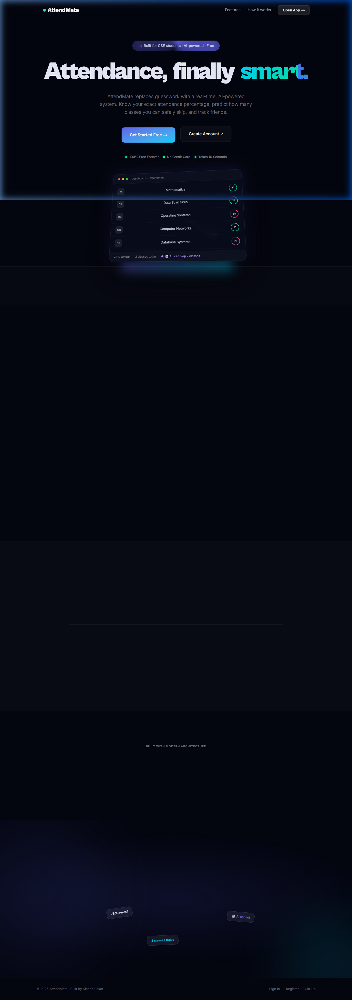
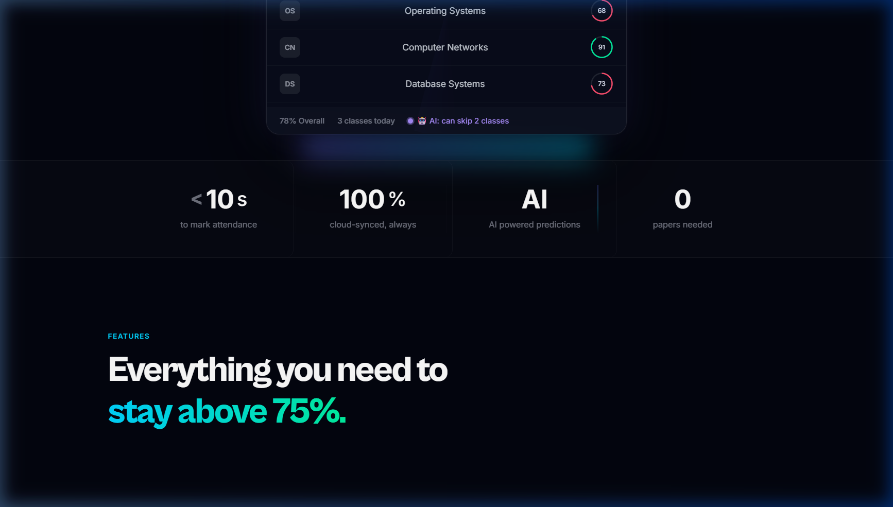
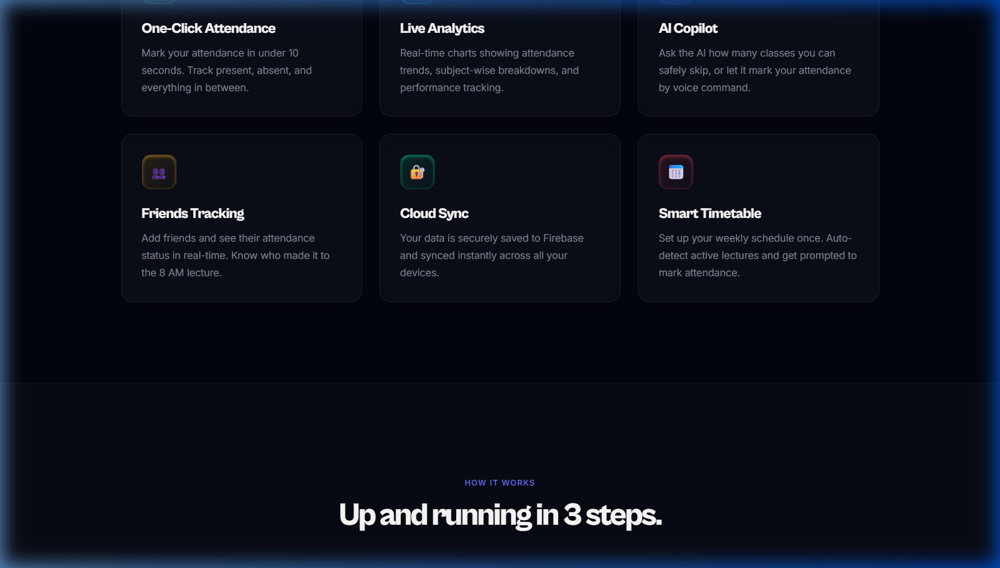
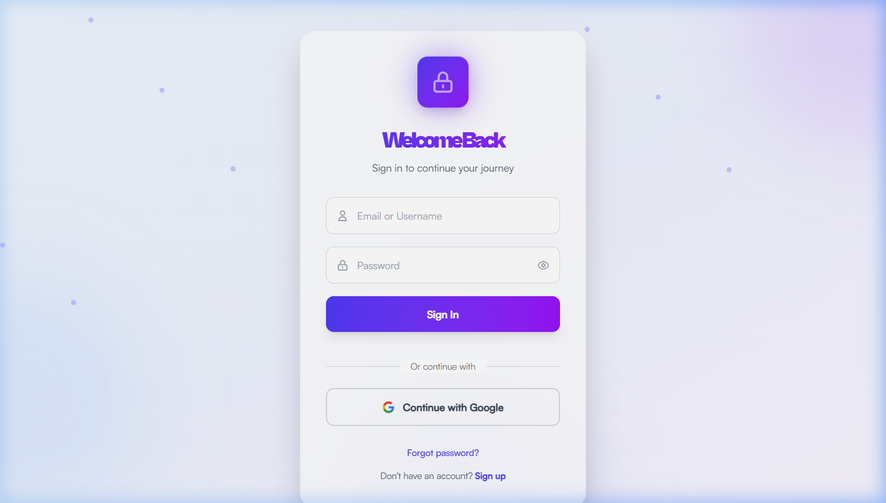
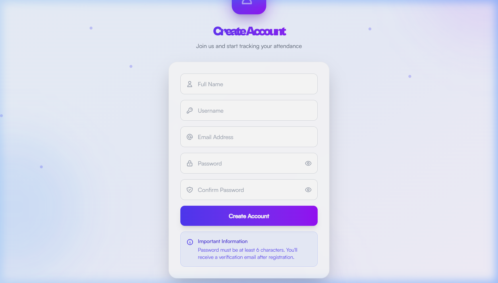
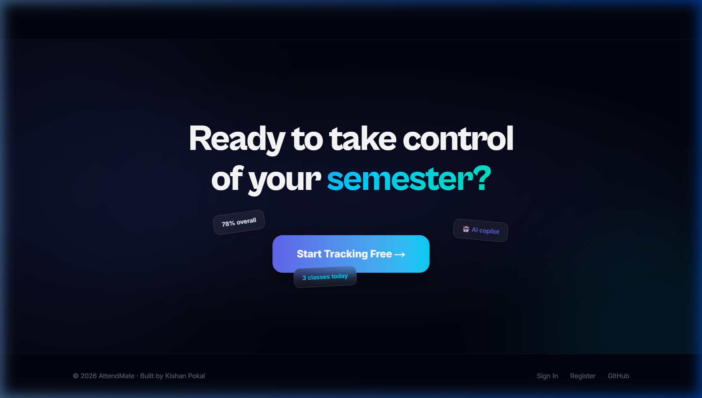

<div align="center">


<br />

# AttendMate

**Attendance, finally smart.**

A full-stack, AI-powered attendance management system built for college students —  
know your exact attendance percentage, predict safe skips, and track friends in real-time.

<br />

[](https://nextjs.org/)
[](https://react.dev/)
[](https://www.typescriptlang.org/)
[](https://firebase.google.com/)
[](https://ai.google.dev/)
[](https://tailwindcss.com/)
[](https://vercel.com/)

<br />

[](https://attendmateweb.vercel.app)
&nbsp;
[](https://github.com/kishanpokal/attendmate-web)

<br />



<sub>Dark-themed landing page with 3D particle animations, glassmorphism dashboard preview, and real-time stats</sub>

</div>

---

## Table of Contents

- [Overview](#-overview)
- [Screenshots](#-screenshots)
- [Features](#-features)
- [Tech Stack](#️-tech-stack)
- [Architecture](#️-architecture)
- [How It Works](#-how-it-works)
- [Dashboard Metrics](#-dashboard-metrics)
- [Project Structure](#-project-structure)
- [Getting Started](#-getting-started)
- [Available Scripts](#-available-scripts)
- [Deployment](#-deployment)
- [Contributing](#-contributing)
- [Author](#-author)
- [License](#-license)

---

## 🧠 Overview

Most college students track attendance mentally — *"I think I've attended enough classes."* That guesswork leads to shortages, debarment notices, and last-minute panic.

**AttendMate replaces guesswork with real-time, AI-powered data.** It tells you your exact attendance percentage, predicts how many classes you can safely skip before hitting the 75% threshold, and lets you track your friends' attendance — all from a beautiful, dark-themed dashboard.

---

## 📸 Screenshots

<table>
  <tr>
    <td width="50%" align="center">
      
      <br /><sub><b>Real-time Stats Bar</b> — &lt;10s attendance, 100% cloud sync, AI predictions</sub>
    </td>
    <td width="50%" align="center">
      
      <br /><sub><b>Feature Cards</b> — One-Click Attendance, Live Analytics, AI Copilot & more</sub>
    </td>
  </tr>
  <tr>
    <td width="50%" align="center">
      
      <br /><sub><b>Login Page</b> — Clean auth UI with Google Sign-In and animated background</sub>
    </td>
    <td width="50%" align="center">
      
      <br /><sub><b>Register Page</b> — Onboarding flow with form validation</sub>
    </td>
  </tr>
  <tr>
    <td colspan="2" align="center">
      
      <br /><sub><b>Call to Action</b> — "Ready to take control of your semester?" with floating badges</sub>
    </td>
  </tr>
</table>

> 🌐 **Try it live:** [attendmateweb.vercel.app](https://attendmateweb.vercel.app)

---

## 🚀 Features

| Feature | Description |
|:---|:---|
| ⚡ **One-Click Attendance** | Mark attendance in under **10 seconds**. Choose Present, Absent, or anything in between. No forms, no friction. |
| 📊 **Live Analytics** | Real-time charts with **subject-wise breakdowns**, trend lines, and performance tracking that update instantly. |
| 🤖 **AI Copilot (Gemini)** | Ask the AI how many classes you can skip. Get **smart predictions** based on your current attendance patterns. |
| 👥 **Friends Tracking** | Add friends and see their attendance **in real-time**. Know who actually made it to the 8 AM lecture. |
| ☁️ **Cloud Sync** | Data securely saved to **Firebase**, synced instantly across all your devices. Never lose your records. |
| 📅 **Smart Timetable** | Set your weekly schedule once. **Auto-detect** active lectures and get prompted to mark attendance. |

---

## 🛠️ Tech Stack

| Category | Technology | Purpose |
|:---|:---|:---|
| **Framework** | Next.js 16 | Full-stack React framework with App Router & SSR |
| **UI Library** | React 19 | Component-based UI rendering with concurrent features |
| **Language** | TypeScript 5 | Type-safe development across the entire codebase |
| **Backend & DB** | Firebase 12 | Authentication, Firestore database, real-time cloud sync |
| **AI Engine** | Gemini AI | AI Copilot — skip predictions, voice commands, insights |
| **Styling** | Tailwind CSS 4 + MUI | Utility-first CSS + Material UI component library |
| **3D & Animations** | Three.js + Framer Motion + GSAP | 3D particle scenes, smooth transitions, scroll animations |
| **Deployment** | Vercel | CI/CD with automatic deployments on every push |

---

## 🏗️ Architecture

```
┌──────────────────────────────────────────────────────────────────┐
│                         CLIENT (Browser)                         │
│                                                                  │
│   ┌─────────────┐   ┌─────────────┐   ┌──────────────────────┐  │
│   │  Next.js 16  │   │   React 19  │   │  Three.js / R3F      │  │
│   │  App Router  │   │  Components │   │  3D Scenes/Particles │  │
│   └──────┬──────┘   └──────┬──────┘   └──────────┬───────────┘  │
│          │                 │                      │              │
│   ┌──────┴─────────────────┴──────────────────────┴──────────┐  │
│   │          Framer Motion  +  GSAP  +  Lenis                │  │
│   │        (Animations, Transitions, Smooth Scroll)          │  │
│   └───────────────────────────┬──────────────────────────────┘  │
│                               │                                  │
└───────────────────────────────┼──────────────────────────────────┘
                                │
                     ┌──────────┴──────────┐
                     │    Firebase SDK      │
                     │  (Client-side Auth)  │
                     └──────────┬──────────┘
                                │
               ┌────────────────┼────────────────┐
               │                │                │
     ┌─────────┴──────┐ ┌──────┴──────┐ ┌───────┴───────┐
     │   Firestore    │ │  Firebase   │ │   Gemini AI   │
     │   Database     │ │    Auth     │ │   (Copilot)   │
     │  (Real-time)   │ │  (Google +  │ │  Predictions  │
     │                │ │   Email)    │ │  & Insights   │
     └────────────────┘ └─────────────┘ └───────────────┘
```

---

## 📋 How It Works

```
  Step 01 — Sign In
  ├── Login with Google or email
  └── Set up your subjects & weekly timetable

  Step 02 — Mark Attendance
  ├── Get auto-prompted when class starts
  └── Tap Present / Absent — done in under 10 seconds

  Step 03 — Get AI Insights
  ├── View real-time analytics on your dashboard
  └── Ask the AI: "How many can I skip this week?"
```

---

## 📊 Dashboard Metrics

The dashboard provides a live, glassmorphism-styled overview of all your key stats:

| Metric | Description |
|:---|:---|
| 📈 **Per-subject %** | Individual attendance for each subject (e.g. Mathematics 82%, DSA 76%) |
| 🎯 **Overall Attendance** | Aggregate attendance percentage across all subjects |
| 🤖 **AI Skip Prediction** | How many classes you can safely skip before dropping below 75% |
| ⚡ **Quick Mark** | One-tap attendance marking in under 10 seconds |
| 📅 **Today's Lectures** | Auto-populated from your timetable with live status indicators |
| 👥 **Friends Feed** | Real-time attendance status of your connected friends |

---

## 🗂️ Project Structure

```
attendmate-web/
├── src/
│   ├── app/                          # Next.js App Router
│   │   ├── page.tsx                  # Landing page (3D hero, features, CTA)
│   │   ├── layout.tsx                # Root layout with metadata & fonts
│   │   ├── globals.css               # Global styles & CSS variables
│   │   ├── login/                    # Authentication — Login
│   │   ├── register/                 # Authentication — Register
│   │   ├── forgot-password/          # Password recovery
│   │   ├── dashboard/                # Main dashboard (protected route)
│   │   ├── attendance/               # Attendance marking & history
│   │   ├── subjects/                 # Subject management
│   │   ├── timetable/                # Weekly schedule setup
│   │   ├── friends/                  # Friends tracking
│   │   ├── analytics/                # Charts & performance analytics
│   │   ├── ai/                       # AI Copilot interface
│   │   ├── settings/                 # User settings
│   │   └── api/                      # API routes
│   │
│   ├── components/
│   │   ├── landing/                  # Landing page components
│   │   │   ├── SmoothNav.tsx         # Animated navigation bar
│   │   │   ├── HeroScene.tsx         # 3D Three.js hero scene
│   │   │   ├── FloatingDashboard.tsx # Glassmorphism dashboard preview
│   │   │   ├── FeatureCards.tsx      # Interactive feature cards grid
│   │   │   ├── HowItWorks.tsx        # Step-by-step guide section
│   │   │   ├── StatsBar.tsx          # Animated statistics counter
│   │   │   ├── TechStack.tsx         # Technology showcase
│   │   │   └── FinalCTA.tsx          # Call-to-action with floating badges
│   │   │
│   │   ├── dashboard/                # Dashboard UI components
│   │   │   ├── DashboardBackground.tsx    # 3D animated background
│   │   │   ├── GlassCard.tsx              # Reusable glassmorphism card
│   │   │   ├── QuickStatsGrid.tsx         # Metrics overview grid
│   │   │   ├── AttendanceSummaryCard.tsx  # Attendance breakdown
│   │   │   ├── SubjectPerformanceCard.tsx # Per-subject analytics
│   │   │   ├── TodayLecturesSection.tsx   # Today's schedule
│   │   │   ├── AICopilotCard.tsx          # AI insights widget
│   │   │   └── AttendanceDialog.tsx       # Quick mark modal
│   │   │
│   │   ├── navigation/               # Navigation components
│   │   └── sync/                     # College sync 3D visualization
│   │
│   ├── context/                      # React context providers
│   ├── hooks/                        # Custom React hooks
│   └── lib/                          # Utilities & configuration
│       ├── firebase.ts               # Firebase SDK initialization
│       ├── collegeSync.ts            # College data sync logic
│       └── ai/                       # AI/Gemini integration
│
├── data/                             # Static & seed data
├── public/                           # Static assets & favicons
│   └── screenshots/                  # README screenshots
├── next.config.ts                    # Next.js configuration
├── tailwind.config.ts                # Tailwind CSS configuration
├── tsconfig.json                     # TypeScript configuration
└── package.json                      # Dependencies & scripts
```

---

## 🚦 Getting Started

### Prerequisites

| Requirement | Version |
|:---|:---|
| Node.js | `v18+` |
| npm / yarn / pnpm | Latest |
| Firebase Project | Firestore + Authentication enabled |
| Gemini API Key | [Get one here](https://ai.google.dev/) |

### Installation

```bash
# 1. Clone the repository
git clone https://github.com/kishanpokal/attendmate-web.git
cd attendmate-web

# 2. Install dependencies
npm install

# 3. Set up environment variables
cp .env.example .env.local
# Fill in your Firebase and Gemini API credentials

# 4. Start the development server
npm run dev
```

Open [http://localhost:3000](http://localhost:3000) in your browser.

### Environment Variables

Create a `.env.local` file in the project root and populate it with the following:

```env
# Firebase Configuration
NEXT_PUBLIC_FIREBASE_API_KEY=your_api_key
NEXT_PUBLIC_FIREBASE_AUTH_DOMAIN=your_auth_domain
NEXT_PUBLIC_FIREBASE_PROJECT_ID=your_project_id
NEXT_PUBLIC_FIREBASE_STORAGE_BUCKET=your_storage_bucket
NEXT_PUBLIC_FIREBASE_MESSAGING_SENDER_ID=your_sender_id
NEXT_PUBLIC_FIREBASE_APP_ID=your_app_id

# Gemini AI
NEXT_PUBLIC_GEMINI_API_KEY=your_gemini_api_key
```

---

## 📦 Available Scripts

| Command | Description |
|:---|:---|
| `npm run dev` | Start the development server at `localhost:3000` |
| `npm run build` | Create an optimized production build |
| `npm run start` | Start the production server |
| `npm run lint` | Run ESLint across the codebase |

---

## 🌐 Deployment

This project is deployed on **Vercel** with automatic CI/CD. Every push to `main` triggers a new production deployment.

<div align="center">

[](https://vercel.com/new/clone?repository-url=https://github.com/kishanpokal/attendmate-web)

</div>

**To deploy your own instance:**

1. Fork this repository
2. Connect it to [Vercel](https://vercel.com)
3. Add your environment variables in the Vercel dashboard
4. Push to `main` — it deploys automatically

---

## 🤝 Contributing

Contributions, issues, and feature requests are welcome. Check the [issues page](https://github.com/kishanpokal/attendmate-web/issues) to get started.

```bash
# 1. Fork the repository

# 2. Create your feature branch
git checkout -b feature/your-feature-name

# 3. Commit your changes
git commit -m "feat: add your feature"

# 4. Push to the branch
git push origin feature/your-feature-name

# 5. Open a Pull Request
```

Please follow [Conventional Commits](https://www.conventionalcommits.org/) for commit messages.

---

## 👨‍💻 Author

<div align="center">

**Kishan Pokal**

[](https://github.com/kishanpokal)
[](https://attendmateweb.vercel.app)

</div>

---

## 📄 License

This project is open source and available under the [MIT License](LICENSE).

---

<div align="center">

If AttendMate helped you, consider giving it a ⭐ on GitHub!

<br />

<sub>Built with ❤️ and ☕ by <a href="https://github.com/kishanpokal">Kishan Pokal</a> · © 2026 AttendMate</sub>


</div>
